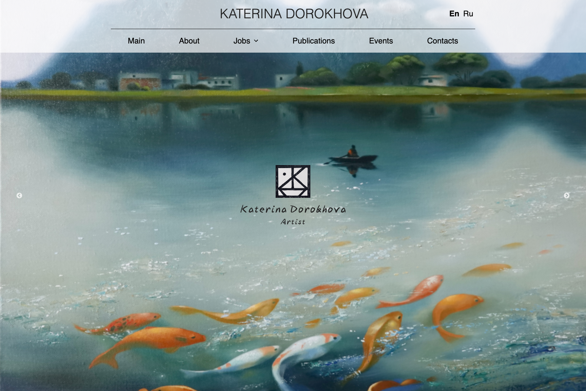
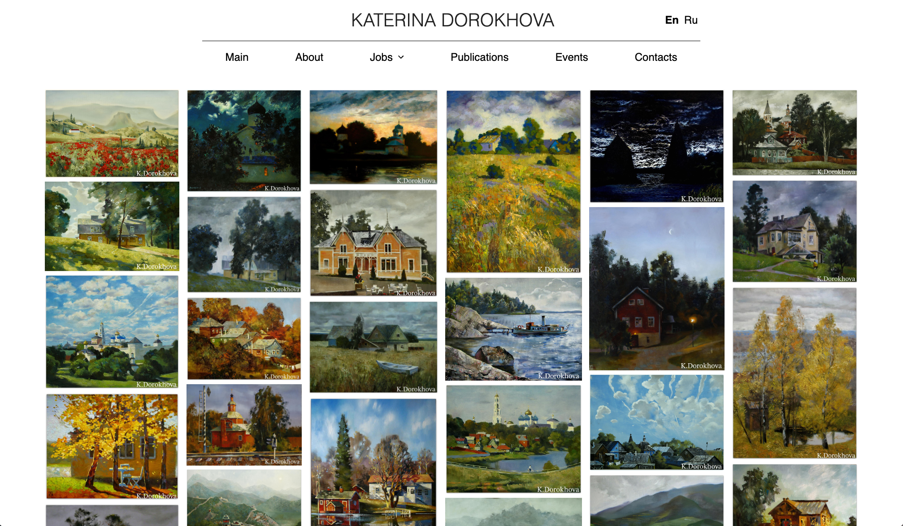

# Продакшн

https://www.katerina-dorohova.ru

# Разработка

- для загрузки пакетов``
npm i
``
- для создания енв файла по примеру
``
cp .env.example .env
``
- для запуска приложения
``
npm run start
``

### Используется методология feature-sliced-design
### Технологоии, библиотеки: 
- typescript
- react
- webpack
- i18next
- axios
- tanstackQuery
- react-slick
